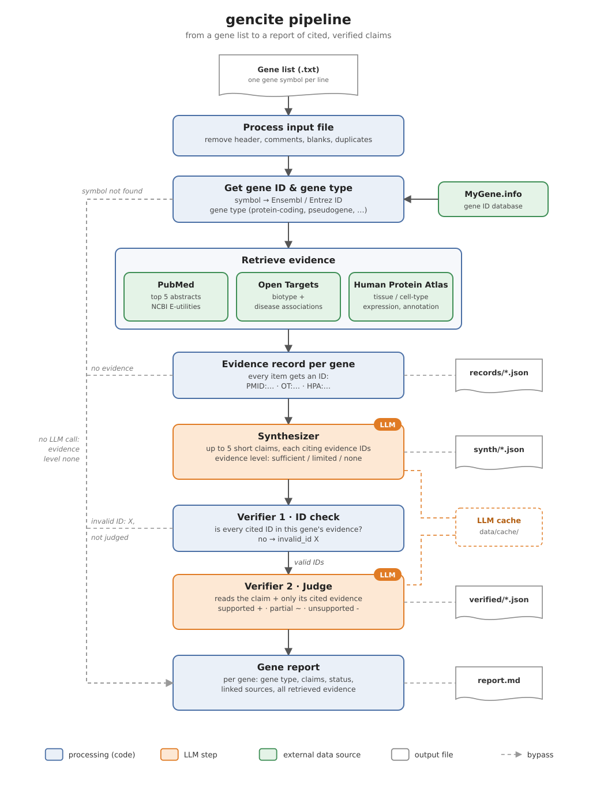

# gencite

## Background

Almost every omics analysis ends with a gene list that someone has to interpret: the candidate genes of a selection scan, the loci of a GWAS, the hits of an RNA-seq or CRISPR screen. The next step is nearly always the same: look up every gene by hand in PubMed, NCBI Gene, Open Targets or the Human Protein Atlas, read abstracts, and write down what is known. For a list of 15–50 genes this takes hours to days, and it is repetitive work.

It is also where the hard cases are. Lists from selection scans in particular contain many genes that are barely studied, plus pseudogenes, long non-coding RNAs and readthrough transcripts. For these, a search mostly returns papers about a related gene or papers that mention the gene only in passing, and telling the two apart takes expert time.

This leads to the question behind `gencite`: can retrieving the evidence first and checking every claim against the source it cites make LLM-written gene summaries traceable, so that a scientist gets statements they can verify in minutes instead of searching the literature gene by gene?

## Why not just ask an LLM?

A large language model answers the same question in seconds, but its answers are not reliable enough to use:

- **Citations that do not back the claim.** Asked for sources, an LLM cites PMIDs from memory. They often exist, but are about something else entirely.
- **Overstated findings.** An association becomes a cause, a mouse result becomes a human one, one study becomes a general fact.
- **Wrong gene.** For a pseudogene or readthrough, the model describes the well-known parent or partner gene instead.
- **No way to check.** Without a real source per statement, the reader has to redo the lookup anyway.

We measured this on our test set (see [Results](#results)): the same LLM without retrieval knew the basic biology of well-described genes, but **84% of the PMIDs it cited never mention the gene**, and **not one of its claims** was backed by the paper it cited.

## What gencite does

`gencite` does the lookup and a first written summary for every gene, and makes each statement checkable:

- **Every claim cites evidence.** Evidence is retrieved first (PubMed, Open Targets, Human Protein Atlas, AMASS). The LLM may only use that evidence, and every claim names the record it is based on.
- **Every citation is checked in code.** A claim that cites an ID not retrieved for that gene is flagged (`invalid_id`).
- **Every claim is checked against its source.** A second LLM call (the judge) reads the claim and only the evidence it cites, and rates it `supported`, `partial` or `unsupported` with a one-line reason.
- **Honest about missing evidence.** Genes without usable evidence (unresolved symbols, most pseudogenes) get no claims and a note that says why.

The result is one report per gene list that a scientist can read and verify, with a link to every source: as a Markdown file from the command line, or as cards in a web interface.

`gencite` does not replace reading the sources. It turns hours of searching into minutes of checking.

Related tools cover parts of this. GeneAgent (Wang et al., *Nature Methods* 2025) names the shared function of a whole gene *set* and checks its output against databases; `gencite` works per gene, with a citation and a verdict on every single claim. WikiCrow / PaperQA2 (FutureHouse, 2024) writes cited, Wikipedia-style articles for human protein-coding genes in advance; `gencite` takes any list, including pseudogenes, ncRNAs and readthroughs, and says "little evidence" where that is the honest answer.

## How it works



| Step | What happens | Data source | Code |
|---|---|---|---|
| Process input file | read the list; header line, comments, blanks and duplicates are removed | – | `inputs.py` |
| Get gene ID & gene type | symbol → Ensembl / Entrez ID and gene type. Symbol not found → evidence level `none`, no LLM call | MyGene.info | `ids.py` |
| Retrieve literature | up to 5 abstracts: papers NCBI links to the gene first; if there are none, a text search with a relevance filter | PubMed (NCBI E-utilities) | `pubmed_retrieval.py` |
| Retrieve disease associations | gene biotype and top 5 disease associations | Open Targets | `opentargets.py` |
| Retrieve expression and annotation | tissue and cell-type expression, biological process, molecular function, disease involvement | Human Protein Atlas | `hpa_retrieval.py` |
| Retrieve gene and protein summaries | gene summary (RefSeq), protein function (UniProt), up to 3 relevant publications | AMASS GeneCore + BiomedCore (needs `AMASS_API_KEY`) | `amass_retrieval.py` |
| Evidence record per gene | all items of a gene, each with an ID (`PMID:…`, `OT:…`, `HPA:…`, `AMASS:…`), duplicates removed. No evidence → `none`, no LLM call | – | `collect_evidence.py` |
| **Synthesizer** (LLM) | up to 5 short claims, each citing evidence IDs, plus an evidence level `sufficient` / `limited` / `none` | LLM | `synth_LLM.py` |
| Verifier 1 · ID check | every cited ID must be in this gene's evidence, otherwise `invalid_id` (`X`) and the claim is not judged | – | `verify.py` |
| **Verifier 2 · Judge** (LLM) | reads the claim and only the evidence it cites → `supported` / `partial` / `unsupported` with a one-line reason | LLM (can be a different model) | `verify.py` |
| Gene report | summary table + one section per gene: gene type, claims, status, source links, all retrieved evidence | – | `create_report.py` |

All pipeline code is in the `gencite/` package (see [Project structure](#project-structure)). Retrieval sources are independent: if one fails or has no entry for a gene (e.g. a pseudogene missing in the Human Protein Atlas), the gene continues with the others.

Each step checks its input and fails locally: every LLM answer must match a schema (invalid output gets one retry with the error message, a claim without a citation is rejected); if one gene fails, the run continues; if a judge call fails, only that claim is marked `unchecked` and a rerun retries just that claim. In the web interface, text from APIs and the LLM is escaped before it is shown.

## Results

We compared `gencite` with the same LLM (`deepseek-chat`) answering from memory. Both get the same task (up to 5 claims per gene, each with citations) and the same output format; the only difference is the retrieved evidence. Both are then checked the same way: the PMIDs the baseline cites are fetched from PubMed, an ID that does not exist fails the code check, and a real paper is judged against its actual abstract by the same judge model (`deepseek-reasoner`), which sees only the claim and the evidence it cites.

The test set has five well-described genes (LCT, IRGM, SPG7, HBG2, ERAP2), where a correct summary must mention known biology, and three negative controls (the pseudogenes MAGOH2P and NOC2LP2, and ABCXYZ, a symbol that does not exist), where the honest answer is "little or no evidence". The expected terms were fixed in advance (`test_data/eval_expected.json`). The verifier itself is tested against deliberately wrong claims in `test_data/synth_bad/`: a made-up PMID, an ID from another gene, an association stated as a cause, a mouse result stated for humans, and a partner gene's biology attributed to a readthrough.

| Metric | gencite | LLM without retrieval |
|---|---|---|
| Claims | 27 | 25 |
| Cited PMIDs that never mention the gene | 0% (0/14) | 84% (16/19) |
| Claims judged `supported` by their cited source | 93% (25/27) | 0% (0/25) |
| Claims judged `partial` | 7% (2/27) | 16% (4/25) |
| Claims judged `unsupported` | 0% | 84% (21/25) |
| Well-described genes: expected biology mentioned | 5/5 | 5/5 |
| Negative controls: no invented function | 3/3 | 3/3 |

For well-described genes the plain LLM's biology was right (5/5), and the PMIDs it cited existed. What failed was the link between claim and citation: the papers were about something else. A check for invented IDs alone would have passed the baseline; only reading the cited source shows the problem. What retrieval plus verification adds is traceability, not better recall.

Typical baseline examples:

| Gene | Baseline claim (shortened) | What the cited paper is about |
|---|---|---|
| SPG7 | SPG7 encodes paraplegin, a mitochondrial AAA protease … | SPG4/spastin and yeast DNA repair |
| IRGM | IRGM regulates autophagy against *M. tuberculosis* … | Foxj1 and motile cilia in zebrafish |
| ERAP2 | ERAP2 is associated with ankylosing spondylitis | ERAP1, not ERAP2 |

The `partial` verdicts of `gencite` in a run on the 15-gene list are small overstatements that are easy to miss when reading quickly, e.g. KHDRBS2 "in prostate cancer cell lines" where the paper used one cell line, or TMEM220 "promoter methylation" where the paper says gene methylation.

Retrieval uses live APIs, so numbers can shift slightly between runs. Reproduce them with the commands in [Evaluation against a baseline](#evaluation-against-a-baseline); report them together with the date and the models used.

## Limitations and responsible use

- The gene type comes straight from MyGene.info: readthroughs show as `protein-coding`, pseudogenes as `unknown`.
- Genes without papers linked in NCBI Gene fall back to a PubMed text search; its relevance filter is conservative, but reviews that only mention a gene in passing can still get through.
- Non-human studies are not filtered out (e.g. MYOZ3: chicken, rat, horse), and claims do not always name the species.
- Only LLM calls are cached; MyGene, PubMed, Open Targets, the Human Protein Atlas and AMASS are called again on every run, so the retrieved evidence (and with it the claims) can change slightly between runs.
- The test set is small (8 genes): enough to show the difference to a plain LLM, not to give precise error rates. Agreement between the judge and a human reviewer has not been measured yet.
- The judge is an LLM too: it can miss an overstated claim, so `supported` means "the judge found it in the cited text", not "proven".
- The time saved against a manual lookup has not been formally measured: `gencite` needs a few seconds per gene, a manual lookup of 3–5 cited facts per gene takes several minutes, but we have not timed this on the test set.
- The judge model (`deepseek-reasoner`) does not support a fixed temperature, so verdicts that are not yet cached can differ slightly between runs.
- `gencite` summarises literature for research; it is not a clinical or diagnostic tool. A generated summary is not a validated finding: the report says so, and every claim links to its source so it can be read before it is used.
- Gene symbols and retrieved evidence are sent to the configured LLM provider. For confidential, unpublished gene lists, use a provider you trust or a local model (any OpenAI-compatible server, e.g. Ollama). The tool itself uses only public databases and no patient or individual-level data.
- The literature favours well-studied genes. "Little evidence" means little is published, not that a gene has no function, which is why `gencite` reports it instead of letting the model fill the gap.
- Gene lists from selection scans often compare human populations. Claims keep the strength of the evidence (association is not causation) and should not be read as statements about populations beyond what the cited studies show.

## Requirements

- Python 3.10 or newer
- Internet access to MyGene.info, NCBI E-utilities, the Open Targets API and the Human Protein Atlas (all free, no key needed)
- An API key for an OpenAI-compatible LLM endpoint (DeepSeek, Groq, Gemini, OpenAI, a local Ollama server, …)
- Optional: an AMASS API key for the AMASS evidence source

All package versions are pinned, so a fresh install matches the tested setup.

Python packages (`requirement.txt`):

| Package | Used for |
|---|---|
| `requests` | MyGene.info, PubMed, Open Targets, Human Protein Atlas and AMASS calls |
| `openai` | LLM calls (any OpenAI-compatible endpoint) |
| `pydantic` | data schemas and validation of the LLM output |
| `python-dotenv` | reading the configuration from `.env` |
| `streamlit` | web interface (`streamlit_app.py`) |

## Installation

```bash
git clone https://github.com/nomis-c/gencite.git
cd gencite
python3 -m venv .venv
source .venv/bin/activate          # Windows PowerShell: .venv\Scripts\Activate.ps1
pip install -r requirement.txt
```

## Configuration

There is no config file. Settings live in two places:

- **`.env`** for the LLM endpoint, model and API keys (per machine, never committed)
- **command-line flags** for everything that changes per run (see [Usage](#usage))

```bash
cp .env.example .env               # then fill in LLM_API_KEY
```

| Variable | Required | Meaning |
|---|---|---|
| `LLM_API_KEY` | **yes** | API key of the LLM provider |
| `LLM_BASE_URL` | only if not DeepSeek (default `https://api.deepseek.com`) | OpenAI-compatible endpoint of the provider |
| `LLM_MODEL` | only if not DeepSeek (default `deepseek-chat`) | model for the synthesizer (and the judge, unless `JUDGE_MODEL` is set) |
| `JUDGE_BASE_URL`, `JUDGE_MODEL`, `JUDGE_API_KEY` | no | a different model as judge; each empty value falls back to `LLM_*` |
| `AMASS_API_KEY` | no | AMASS GeneCore + BiomedCore evidence; without it the AMASS source is skipped |
| `GENCITE_NO_CACHE` | no | `1` turns the cache off (same as `--no-cache`) |

With a DeepSeek key, `LLM_API_KEY` is the only line you need. For any other provider set all three `LLM_*` values, e.g. for Google Gemini:

```
LLM_BASE_URL=https://generativelanguage.googleapis.com/v1beta/openai/
LLM_MODEL=gemini-2.5-flash
LLM_API_KEY=<your key>
```

## Usage

Run the whole pipeline on the example list (15 genes, about 3–4 minutes on the first run):

```bash
python -m gencite test_data/gene_list.txt
```

Then open `results/gene_list/report.md` (e.g. in the PyCharm or VS Code Markdown preview).

Your own list is a text file with one gene symbol per line. A header line such as `Gene` or `Symbol` is detected and skipped.

### Web interface

```bash
streamlit run streamlit_app.py
```

Then open http://localhost:8501. Upload a `.txt` gene list, choose the evidence sources (PubMed, Open Targets, Human Protein Atlas, AMASS) and click **Analyse genes**. Each gene is shown as a card with its claims, their status, the verifier's reason and links to the sources; the Markdown report can be downloaded. Without `LLM_API_KEY` the app still resolves the genes and shows the retrieved evidence, but writes no claims.

### Commands

| Command | What it does |
|---|---|
| `python -m gencite <genes.txt>` | whole pipeline, gene list → report, results in `results/<list name>/` |
| `python -m gencite <genes.txt> --out results/my_run` | write to another folder |
| `python -m gencite <genes.txt> --no-judge` | skip verifier 2 (judge), claims get `?`, fewer LLM calls |
| `python -m gencite <genes.txt> --no-cache` | ask the LLM again instead of using cached answers |
| `python -m gencite <records folder>` | synthesizer → report on saved evidence (no retrieval), e.g. `results/gene_list/records` |
| `python -m gencite --help` | all options |
| `python -m gencite.cache` / `python -m gencite.cache --clear` | show / delete only the LLM cache in `data/cache/` |

Single steps, e.g. to look at the prompts or rerun one stage (default output: `results/steps/`):

| Step | Command |
|---|---|
| Synthesizer | `python -m gencite.synth_LLM <records> [--out DIR] [--dry-run]` |
| Verifier 1 + 2 | `python -m gencite.verify <synth> <records> [--out DIR] [--no-llm] [--dry-run]` |
| Gene report | `python -m gencite.create_report <verified> <records> [--out FILE]` |

`--dry-run` prints the LLM prompts without calling the LLM, `--no-llm` runs only verifier 1 (ID check).

### Output

Everything the pipeline generates goes to `results/`. Each run gets its own folder, named after the input (`results/gene_list/` for `test_data/gene_list.txt`). A new run of the same input first deletes the old results in that folder, so genes from different runs never mix.

`results/<name>/`:

| Path | Content |
|---|---|
| `records/` | retrieved evidence per gene (JSON), only when the input is a gene list |
| `synth/` | claims with the cited evidence IDs (JSON) |
| `verified/` | claims with status and the judge's reason (JSON) |
| `report.md` | summary table and one section per gene: gene type, Ensembl link, evidence level, claims with status, source links, and all retrieved evidence marked "cited" or "not cited" |

Claim status in the report:

| Mark | Status | Meaning |
|---|---|---|
| `+` | supported | the cited evidence states the claim |
| `~` | partial | only part is backed, or the claim overstates it (e.g. association → causation, mouse → human) |
| `-` | unsupported | the cited evidence does not back the claim |
| `X` | invalid_id | the claim cites an ID that was not retrieved for this gene |
| `?` | unchecked | the judge was skipped (`--no-judge`) or its call failed |

The synthesizer runs at temperature 0 and every LLM answer is cached by model and prompt (never with the API key), so the same evidence gives the same claims on a rerun.

Exit code 1 means some genes or claims failed, usually because of an LLM rate limit. Run the same command again: finished LLM calls come from the cache, only the failed ones are repeated.

## Testing

Automated tests run offline: no API key, no network, no LLM calls, about a second.

```bash
pip install -r requirement_dev.txt                # once: requirement.txt + pytest + black
python -m pytest                                  # tests/ (also run by GitHub Actions on every push and pull request)
black --check gencite/ streamlit_app.py tests/    # formatting
```

`test_data/` is the test data set:

| Path | Content | Used by |
|---|---|---|
| `test_data/gene_list.txt` | 15 real genes | whole pipeline with live retrieval: `python -m gencite test_data/gene_list.txt` |
| `test_data/dummy_records/` | hand-written evidence for 6 genes with made-up PMIDs, incl. traps (a readthrough whose evidence is about its partner gene, a pseudogene, an unresolved symbol) | synthesizer → report without retrieval: `python -m gencite test_data/dummy_records` |
| `test_data/synth_bad/` | deliberately wrong claims | verifier test: `python -m gencite.verify test_data/synth_bad test_data/dummy_records` |

### Evaluation against a baseline

The baseline is the same LLM without retrieval: it writes claims from memory and cites PMIDs it remembers. The cited PMIDs are fetched from PubMed and checked by the same verifier and judge as `gencite`. The test set (`test_data/eval_genes.txt`, expected terms in `test_data/eval_expected.json`) has five well-described genes and three negative controls (two pseudogenes, one symbol that does not exist).

```bash
python -m gencite test_data/eval_genes.txt        # gencite  -> results/eval_genes/
python -m gencite.baseline test_data/eval_genes.txt   # baseline -> results/eval_genes/baseline/
python -m gencite.evaluate results/eval_genes         # -> results/eval_genes/evaluation.md (no API or LLM calls)
```

Clean up after testing: `rm -rf results/ data/cache/`.

## Project structure

```
gencite/
├── gencite/                     # the pipeline (Python package)
│   ├── __main__.py              # python -m gencite <genes.txt>, same as cli.py
│   ├── cli.py                   # entry point: whole pipeline
│   ├── inputs.py                # gene list parsing
│   ├── ids.py                   # gene ID + gene type (MyGene.info)
│   ├── pubmed_retrieval.py      # PubMed search + abstracts
│   ├── opentargets.py           # Open Targets biotype + disease associations
│   ├── hpa_retrieval.py         # Human Protein Atlas expression + annotation
│   ├── amass_retrieval.py       # AMASS GeneCore summaries + BiomedCore literature
│   ├── collect_evidence.py      # evidence record per gene (all sources)
│   ├── synth_LLM.py             # synthesizer (LLM)
│   ├── verify.py                # verifier 1 (ID check) + verifier 2 (LLM judge)
│   ├── create_report.py         # gene report (Markdown)
│   ├── baseline.py              # baseline: same LLM without retrieval
│   ├── evaluate.py              # gencite vs. baseline on the test set
│   ├── schema.py                # data shapes shared by all steps (pydantic)
│   ├── llm_client.py            # LLM calls: config from .env, retries, JSON validation, cache
│   └── cache.py                 # disk cache in data/cache/
├── streamlit_app.py             # web interface
├── .streamlit/config.toml       # web interface theme
├── test_data/
│   ├── README.md                # what each test case checks
│   ├── gene_list.txt            # 15 real genes
│   ├── eval_genes.txt           # evaluation set: 5 well-described genes + 3 negative controls
│   ├── eval_expected.json       # expected terms per evaluation gene
│   ├── dummy_records/           # hand-written evidence with made-up PMIDs
│   └── synth_bad/               # deliberately wrong claims for the verifier
├── tests/                       # offline pytest suite
├── .github/workflows/ci.yml     # formatting + tests on every push and pull request
├── img/                         # pipeline diagram
├── requirement.txt              # dependencies to run gencite
├── requirement_dev.txt          # + pytest and black
├── pyproject.toml               # settings for pytest and black
├── .env.example                 # template for .env (API keys, never committed)
├── data/cache/                  # cached LLM answers (git-ignored)
└── results/                     # everything the pipeline generates (git-ignored)
    └── {list name}/
        ├── records/             # retrieved evidence per gene (JSON)
        ├── synth/               # claims with cited evidence IDs (JSON)
        ├── verified/            # claims with verdict and judge reason (JSON)
        ├── report.md            # the gene report
        └── baseline/            # baseline run: records/, synth/, verified/
```
